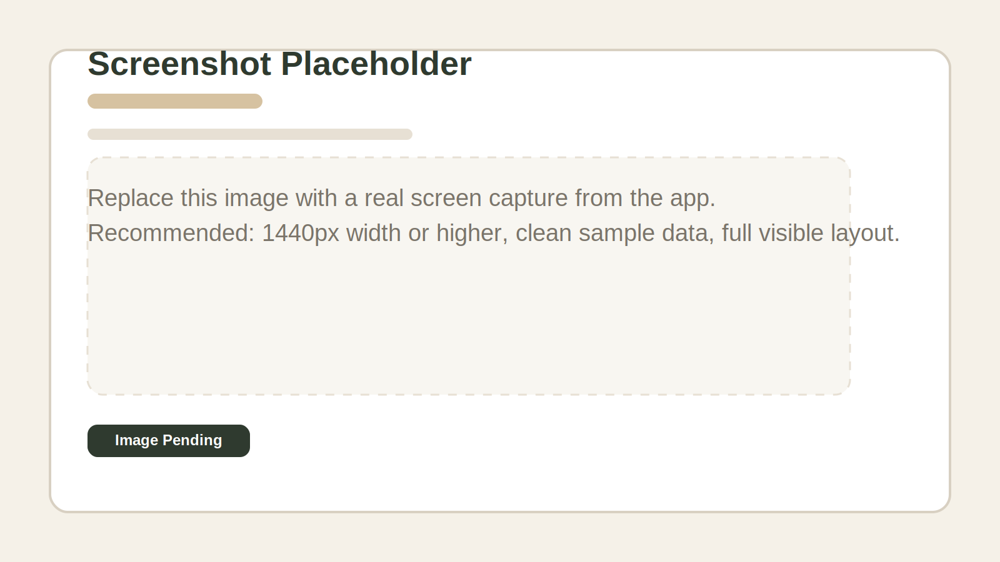

# Hotel System Frontend Documentation

## Why Professional Documentation Matters

Professional frontend documentation is not just a reference file. It is an operational asset that helps teams train staff faster, reduce user mistakes, support handover between developers and hotel teams, and make future maintenance safer. A well-structured document with screen-by-screen explanations gives managers, front-desk staff, QA reviewers, and future developers a shared understanding of what each page is for and how the workflow is expected to behave.

This documentation is designed to serve four goals:

1. Explain the purpose of every major screen in the frontend.
2. Show where each screen sits in the user journey.
3. Help onboarding and day-to-day support.
4. Provide a structure where real screenshots can be inserted later without rewriting the document.

## Screenshot Note

The current environment does not allow real UI screenshot capture, so this documentation uses a placeholder image. Replace the placeholder in each section with a real screen capture when available.

Suggested screenshot standard:

- Resolution: 1440px wide or higher
- Data: realistic sample hotel data
- Style: clean visible state with nav, table, and primary controls in frame
- Format: PNG preferred

## System Areas

- Authentication
- Admin
- Manager
- Front Desk
- Shared Reservation Details

---

## 1. Authentication

### 1.1 Login

**Purpose**  
Allows authorized users to access the platform using their credentials.

**What this screen does**
- Authenticates the user
- Redirects the user based on role and access rights
- Serves as the main entry point to the system

### 1.2 Register

**Purpose**  
Creates a new account when registration is enabled.

**What this screen does**
- Captures new user information
- Submits the registration request
- Starts account onboarding

### 1.3 Complete Registration

**Purpose**  
Completes any remaining profile or account setup data after initial registration.

### 1.4 Forget Password

**Purpose**  
Starts the password recovery flow.

### 1.5 Verify

**Purpose**  
Validates a recovery or account verification step.

### 1.6 Reset Password

**Purpose**  
Allows the user to set a new password securely.

---

## 2. Admin Screens

### 2.1 Admin Dashboard

**Purpose**  
Gives platform-level visibility across requests and administrative operations.

**What this screen does**
- Lists high-level admin data
- Helps the admin navigate into specific request details

### 2.2 Request Details

**Purpose**  
Displays a single admin request in detail for review and follow-up.

---

## 3. Manager Screens

### 3.1 Manager Home

**Purpose**  
Acts as the landing screen for manager access.

### 3.2 Manager Dashboard

**Purpose**  
Shows operational indicators and summary information for the hotel manager.

**What this screen does**
- Surfaces current hotel activity
- Helps managers monitor occupancy and reservation flow

### 3.3 Users

**Purpose**  
Manages hotel users and access.

### 3.4 Travel Agents

**Purpose**  
Maintains the list of travel agents used in reservations and reporting.

**What this screen does**
- Create travel agents
- Update travel agent profiles
- Delete inactive or incorrect travel agents

### 3.5 Channel Management

**Purpose**  
Provides the entry point for future OTA and middleware integrations.

**Current status**
- Visible in the frontend
- Marked as Coming Soon

**Planned role**
- Provider connection setup
- Reservation import and sync
- Connection monitoring
- Field mapping support

### 3.6 Reports Hub

**Purpose**  
Groups manager-facing reports in one area.

#### 3.6.1 Manager Flash

**Purpose**  
Provides a quick business snapshot for the selected day.

#### 3.6.2 Room Status Report

**Purpose**  
Shows room availability and operational status summary.

#### 3.6.3 Folio History Report

**Purpose**  
Displays folio history records, limited by business rules from the backend.

#### 3.6.4 Cashier Report

**Purpose**  
Summarizes payment activity and cashier totals.

### 3.7 Settings

**Purpose**  
Manages hotel settings and internal documentation.

#### 3.7.1 Terms and Conditions

**Purpose**  
Stores and updates printable hotel terms used across the system.

#### 3.7.2 Recommendation

**Purpose**  
Provides manager-side recommendation content and related settings.

#### 3.7.3 Hotel Logs

**Purpose**  
Tracks major hotel actions for operational traceability.

**What this screen does**
- Shows who performed an action
- Shows what action happened
- Shows the target area and details
- Helps managers audit activity

### 3.8 Rooms Module

**Purpose**  
Groups all room configuration areas.

#### 3.8.1 Room Management

**Purpose**  
Creates and maintains physical room records.

#### 3.8.2 Room Type

**Purpose**  
Defines room type classifications used throughout the hotel.

#### 3.8.3 Room Category

**Purpose**  
Defines business categories for grouping rooms.

#### 3.8.4 Package

**Purpose**  
Manages room packages and bundled commercial offerings.

#### 3.8.5 Services

**Purpose**  
Maintains billable or configurable hotel services.

---

## 4. Front Desk Main Areas

### 4.1 Booking Module

**Purpose**  
Controls reservation creation, search, availability review, and room planning.

#### 4.1.1 Manage Reservation

**Purpose**  
Lists active reservation records for review and access.

**What this screen does**
- Searches reservations
- Filters by operational criteria
- Excludes in-house stays based on business rules
- Opens reservation details

#### 4.1.2 Create Posting

**Purpose**  
Creates a reservation/posting flow with selected dates, rooms, and totals.

#### 4.1.3 Availability

**Purpose**  
Checks room availability within selected stay dates.

#### 4.1.4 Room Diary

**Purpose**  
Presents room occupancy visually across dates for planning and control.

### 4.2 Front Office Module

**Purpose**  
Handles arrival, in-house, departure, and no-show operations.

#### 4.2.1 Arrival

**Purpose**  
Shows today’s arrivals and supports check-in.

#### 4.2.2 Departure

**Purpose**  
Shows checked-in guests due to depart and supports check-out.

#### 4.2.3 In House

**Purpose**  
Shows current in-house guests with stay information.

#### 4.2.4 No Show

**Purpose**  
Lists reservations that missed arrival and require follow-up.

#### 4.2.5 Recommendation

**Purpose**  
Provides contextual recommendation support for front-office operations.

### 4.3 Inventory Module

**Purpose**  
Controls room operational inventory conditions.

#### 4.3.1 Out of Service

**Purpose**  
Marks and manages rooms that are unavailable for sale.

#### 4.3.2 House Keeping Board

**Purpose**  
Tracks housekeeping and room readiness flow.

### 4.4 Finance Module

**Purpose**  
Provides folio visibility, cashier summaries, and utility finance tools.

#### 4.4.1 Folio History

**Purpose**  
Shows folio history records for eligible reservations according to backend rules.

#### 4.4.2 Cashier

**Purpose**  
Displays summarized payment information and method totals.

#### 4.4.3 Currency Calculator

**Purpose**  
Helps staff quickly convert currencies during operations.

### 4.5 Reports Module

**Purpose**  
Provides front-desk operational reports.

#### 4.5.1 Expected Arrivals

**Purpose**  
Shows reservations expected to arrive within the selected period.

#### 4.5.2 In-House Guests Report

**Purpose**  
Lists current in-house guests in report format.

#### 4.5.3 Reservation Ledger

**Purpose**  
Shows reservation, status, and stay-status reporting in one table.

#### 4.5.4 No Show / Cancel

**Purpose**  
Summarizes cancellations and no-show reservations.

#### 4.5.5 Police

**Purpose**  
Shows guest identification and stay records required for compliance workflows.

#### 4.5.6 Room Status

**Purpose**  
Summarizes room operational status.

#### 4.5.7 Night Audit

**Purpose**  
Provides daily financial and operational reporting for audit purposes.

---

## 5. Reservation Details Flow

### 5.1 Reservation Details Container

**Purpose**  
Acts as the central detailed view for a selected reservation.

### 5.2 Main Info

**Purpose**  
Shows and edits core reservation data such as guest info and dates.

### 5.3 Rooms

**Purpose**  
Shows room allocation details linked to the reservation.

### 5.4 Services

**Purpose**  
Displays services linked to the reservation.

### 5.5 Payments

**Purpose**  
Displays recorded payments and settlement information.

### 5.6 Alerts

**Purpose**  
Stores warning notes, flags, or guest-related alerts.

### 5.7 Print

**Purpose**  
Generates a printable reservation summary.

---

## 6. Documentation Maintenance Guide

To keep this documentation professional over time:

1. Replace each placeholder image with a real screenshot matching the section title.
2. Update the purpose text whenever business rules change.
3. Review the document after every major release.
4. Keep naming consistent with the visible labels in the application.
5. Use the same screenshot size and zoom level for every screen.

## 7. Recommended Documentation Workflow

For future releases, the best professional workflow is:

1. Freeze the release scope.
2. Capture fresh screenshots after QA approval.
3. Update documentation text based on final behavior.
4. Review with one business user and one developer.
5. Export the document to PDF for hotel operations teams if needed.
